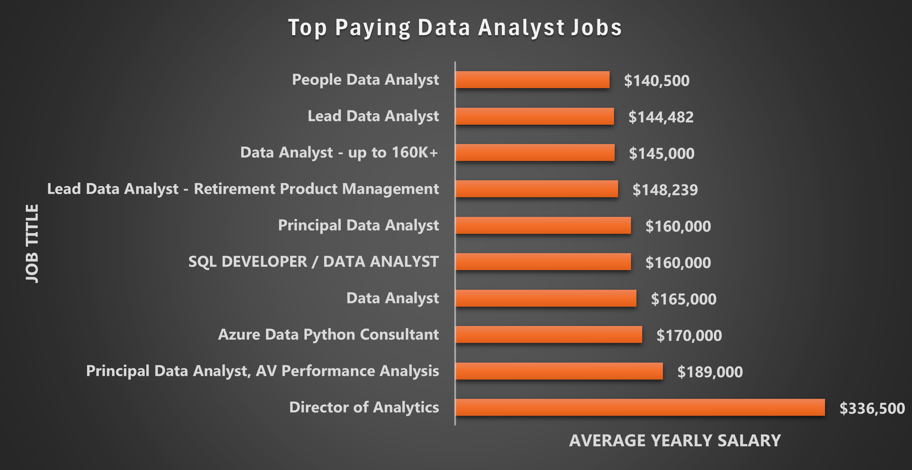
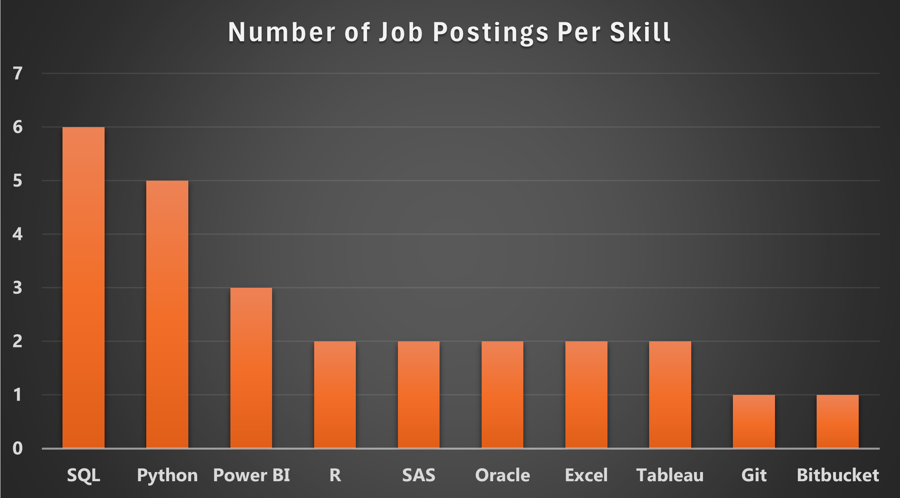

# Introduction
LinkedIn is the biggest connector for aspiring Data Analysts and their future place of employment! This project will showcase the most admirable skills (high-demand ⬆️ and high-paying 💵) one should have in order to earn a better chance at obtaining their work-from-home dream job.

Check out the SQL Queries used for this project here: [project_sql](/project_sql/)

# Background
With LinkedIn being the go-to site for my job seekers, this project originated from wondering what skills would an aspiring data analyst (who prefers to work from home) have to learn to score their desired job. More specifically, what are the highest paying, most in demand skills for job postings that are on LinkedIn.

### Here are the questions I aimed to answer with this project:

1. What are the top-paying data analyst jobs?
2. What skills are required for these top-paying jobs?
3. What skills are most in demand for data analysts?
4. Which skills are associated with higher salaries?
5. What are the most optimal skills to learn for a data analyst looking to maximize job market value?

# Tools I Used

**SQL**: The core tool that I used to analyze the data and generate insights on the database.

**Visual Studio Code**: The software where (along with SQL) I exercised and executed all of my queries.

**PostgreSQL**: A reliable database management system that secured the job posting data.

**Git & GitHub**: Used for sharing my queries and the results that I found during my data analysis.

# The Analysis
Each query was developed to answer a particular question I had relating to the current data analysis job market.

### 1. Top Paying Data Analyst Jobs
To discover the highest-paying jobs, I used four specific filters on the data set: I only searched for jobs that were specifically for 'Data Analyst', had an average yearly salary attached to the job, was a work-from-home and the job posting was specifically found on LinkedIn. To see the most desired findings, I limited the data to the Top 10 results.

```sql
SELECT
    job_id,
    job_title,
    job_location,
    job_schedule_type,
    salary_year_avg,
    job_posted_date,
    name AS company_name
FROM
    job_postings_fact
LEFT JOIN company_dim ON job_postings_fact.company_id = company_dim.company_id
WHERE job_title_short = 'Data Analyst' AND 
job_work_from_home = TRUE AND
job_via = 'via LinkedIn' AND
salary_year_avg IS NOT NULL
ORDER BY
    salary_year_avg DESC
LIMIT 10
```
Breakdown of Data Analyst Jobs in 2023:

- **Full-Time Schedule:** 9 of the 10 highest paying roles are Full-Time positions, with the exception being a "Contractor". This indicates a stable, rigid and reliable schedule amongst the top paying jobs.

- **Different Employers:** 9 of the 10 highest paying roles are from different employers. "Edward Jones" has 2 of the Top 10, while other companies from Realtime Recuritment, Motional and Insight Global all have a stake in these roles. Which shows more opportunities to find a role across the data analyst landscape.

- **Salary Range:** The Top 10 paying work-from-home data analyst roles range from $140,500 to $336,500. This shows the lucrativeness of a work-from-home data analyst role.

**Below is a bar chart that I created in Microsoft Excel to highlight these top paying roles graphically*



### 2. Skills for Top Paying Jobs
Certain skills will be required to obtain a top-paying Data Analyst job. In order to see what these skills are, I combined the skills data with the job postings data.
```sql
WITH top_paying_jobs AS (
    SELECT
        job_id,
        job_title,
        salary_year_avg,
        name AS company_name
    FROM
        job_postings_fact
    LEFT JOIN company_dim ON job_postings_fact.company_id = company_dim.company_id
    WHERE 
        job_title_short = 'Data Analyst' AND 
        job_work_from_home = TRUE AND
        job_via = 'via LinkedIn' AND
        salary_year_avg IS NOT NULL
    ORDER BY
        salary_year_avg DESC
    LIMIT 10
)

SELECT
    top_paying_jobs.*,
    skills
FROM top_paying_jobs
INNER JOIN skills_job_dim ON top_paying_jobs.job_id = skills_job_dim.job_id
INNER JOIN skills_dim ON skills_job_dim.skill_id = skills_dim.skill_id
ORDER BY 
    salary_year_avg DESC
```
**Breakdown of the Most Demanded Skills for high-paying, work-from-home Data Analyst jobs that were posted on LinkedIn**:

There were 26 unique skills listed amongst 42 job postings, with the most popular being

- **SQL:** Mentioned in 6 job postings.
- **Python:** Mentioned in 5 job postings.
- **Power BI:** Mentioned in 3 job postings.
- **Other Skills:** Various other skills were such as Hadoop, Statistical Product and Service Solutions (SPSS) and Java were only mentioned once amongst the 42 job postings.

*Below is a bar chart I created in Microsoft Excel to show 10 of the 26 unique skills amongst the 42 job postings*.



### 3. Top 5 In-Demand Skills for Data Analysts
In this query, instead of focusing on skills requried specifically for high-paying jobs, I identified the most requested skills in general for work-from-home Data Analyst roles that were posted on LinkedIn. This allows job-seekers to get an idea of what they skills to obtain to land a Data Analyst role in general, even if it's not a high-paying one.

```sql
SELECT
    skills,
    COUNT(skills_job_dim.job_id) AS demand_count
FROM job_postings_fact
INNER JOIN skills_job_dim ON job_postings_fact.job_id = skills_job_dim.job_id
INNER JOIN skills_dim ON skills_job_dim.skill_id = skills_dim.skill_id
WHERE
    job_title_short = 'Data Analyst' AND
    job_work_from_home = TRUE AND
    job_via = 'via LinkedIn' AND
    salary_year_avg IS NOT NULL
GROUP BY
    skills
ORDER BY demand_count DESC
LIMIT 5
```
**The Top 5 most requested skills are as follows:**

| Skills | Demand Count |
|----------|----------|
SQL          |88
Python       |55
Excel        |45
Tableau      |44
R            |35

- **Python** and **R** are generally regarded as being the same programs and that if you learn one, you will understand the core basics of the other. However, Python seems to be the one employers believe it is more adventagous to have your job search.

- **SQL** is far and away the most fundamental tool to becoming a Data Analyst. Strengthening your ability to run queries in SQL is a core milestone in your job search.

### 4. Top 10 Skills Based on Salary
For this query, I determined the average salary associated with each skill and ranked the Top 25 based on the highest average salary.
```sql
SELECT
    skills,
    ROUND(AVG(salary_year_avg), 0) AS avg_salary
FROM job_postings_fact
INNER JOIN skills_job_dim ON job_postings_fact.job_id = skills_job_dim.job_id
INNER JOIN skills_dim ON skills_job_dim.skill_id = skills_dim.skill_id
WHERE
    job_title_short = 'Data Analyst' AND
    job_work_from_home = TRUE AND
    job_via = 'via LinkedIn' AND
    salary_year_avg IS NOT NULL
GROUP BY
    skills
ORDER BY avg_salary DESC
LIMIT 25
```

The query above determined the Top 25 skills.

**The following table only highlights the Top 10:**

| Skills | Average Salary |
|----------|----------|
Bitbucket    |$189,000
Databricks   |$170,000
MicroStrategy|$148,239
NoSQL        |$144,119
Atlassian    |$140,750
Scala        |$139,000
Unix         |$130,000
Dax          |$130,000
Visio        |$130,000
IBM Db2      |$128,919

- **Niche Specialized Skills Lead To More $$$** - Every skill that is listed in the table above was not inlcuded in the most demanded skills layout in #2 and #3. Showing that having a specialization in these skills will make you a very unique and profitable prospect.

- **AI Tools Are Your Best Friend** - Bitbucker, Databricks and DataRobot are huge AI tools in the current data landscape. So knowing how to use AI will be massive boost to your job search if you're looking for high-paying roles.

- **Diversity Matters** - Employers are looking for everything from Big Data software skills (Scala) and Formula Expression Language (Dax). So being diversified in your skills will net satisfactory results

### 5. The Most Optimal Skills
This section combines previous breakdowns and shows which skills are the most sought after by employers AND have a salary on the higher end.
```sql
WITH skills_demand AS (
    SELECT
        skills_dim.skill_id,
        skills_dim.skills,
        COUNT(skills_job_dim.job_id) AS demand_count
    FROM job_postings_fact
    INNER JOIN skills_job_dim ON job_postings_fact.job_id = skills_job_dim.job_id
    INNER JOIN skills_dim ON skills_job_dim.skill_id = skills_dim.skill_id
    WHERE
        job_title_short = 'Data Analyst' AND
        job_work_from_home = TRUE AND
        job_via = 'via LinkedIn' AND
        salary_year_avg IS NOT NULL
    GROUP BY
        skills_dim.skill_id
), average_salary AS (
    SELECT
        skills_job_dim.skill_id,
        ROUND(AVG(salary_year_avg), 0) AS avg_salary
    FROM job_postings_fact
    INNER JOIN skills_job_dim ON job_postings_fact.job_id = skills_job_dim.job_id
    INNER JOIN skills_dim ON skills_job_dim.skill_id = skills_dim.skill_id
    WHERE
        job_title_short = 'Data Analyst' AND
        job_work_from_home = TRUE AND
        job_via = 'via LinkedIn' AND
        salary_year_avg IS NOT NULL
    GROUP BY
        skills_job_dim.skill_id
)

SELECT
    skills_demand.skill_id,
    skills_demand.skills,
    demand_count,
    avg_salary
FROM
    skills_demand
INNER JOIN average_salary ON skills_demand.skill_id = average_salary.skill_id
WHERE demand_count > 10
ORDER BY
    demand_count DESC,
    avg_salary DESC
```
I filtered the results to only show skills that were in at least 10 job postings. There were 7 skills that appeared to be high in both demand and salary: 

(**Table is sorted by highest average salary in desecending order)**

| Skills | Average Salary | Demand Count
|----------|----------|----------|
Power BI     |$104,588 | 21
SAS          |$100,779 | 12
Python       |$99,923  | 55
SQL          |$98,910  | 88
Tableau      |$95,064  | 44
R            |$94,122  | 35
Excel        |$90,138  | 45

- **SQL and Python** are the two most in-demand skills and have an average salary of over $98,000+ each.

- **Power BI and SAS** , although not be as requested as SQL and Python, are the most lucrative skills to know for a Data Analyst.

- **Querying & Visualization Tools** are very important, must-know skills across the data analyst landscape. In order to land the most optimal role, knowing how to run queries and knowing how to visualize your data findings is essential to your career.

# What I Learned
This project allowed me to refresh my memory on SQL functions such as JOIN and aggregates (AVG, COUNT, ROUND). I also learned new SQL functions such as TIMESTAMP WITH TIME ZONE and DATE.

- **PostgreSQL** ✅ | A querying tool that was new to me before this project, that I easily grasped thanks to my familiar knowledge of MySQL.

- **Visual Studio Code** ✅ | This project was my introduction to using Visual Studio Code and I instantly grew to love the interface and ease of use of the software.

- **GitHub** ✅ | Working with Git and GitHub for the first time taught me how to create/delete repositories and how to Push/Pull my work from Visual Studio Code into the respective respositories.

# Conclusions
### Insights

1. **Top Paying Data Analyst Jobs** | The highest-paying jobs for work-from-home data analyst jobs that were spefically posted on LinkedIn offered a wide range of sarlries. The highest of these salaries being $336,500

2. **Skills for Top Paying Jobs** | Amongst the 42 LinkedIn job postings that are for work-from-home data analysts, SQL is the skill that was mentioned the most times, with 6 postings.

3. **Most In-Demand Skills** | Even if I remove the filter of "high-paying" roles when searching for work-from-home data analyst jobs, SQL is still the most sought-after skill. Being mentioned in job postings 88 times. Showing that whether you're looking for a high salary role or not, SQL is very important to learn.

4. **Skills with Higher Salaries** | Knowing niche skills such as Bitbucket and Databricks leads to the highest paying roles. With Bitbucket having an average salary of $189,000 and Databricks having an average salary of $170,000.

5. **The Most Optimal Skills To Learn** | In order to maximize your value in the data analyst job nmarket, especially if you are looking for roles through LinkedIn, SQL is very essential to learn. Having being mentioned amongst 88 job postings and having an average yearly salary of $98,910.

### Closing Thoughts
As someone who mostly uses LinkedIn for job searching and being at an intermediate level with data analytics, this project opened my eyes on which skills are the most important to learn to land my dream career. These include tools that specialize in data visulization, querying, artificial intelligence and big data. Although it is not necessary to know everything about every piece of software, having a basic/elementary level understand of these tools alone gives you a big step forward to finding a career in data analytics.